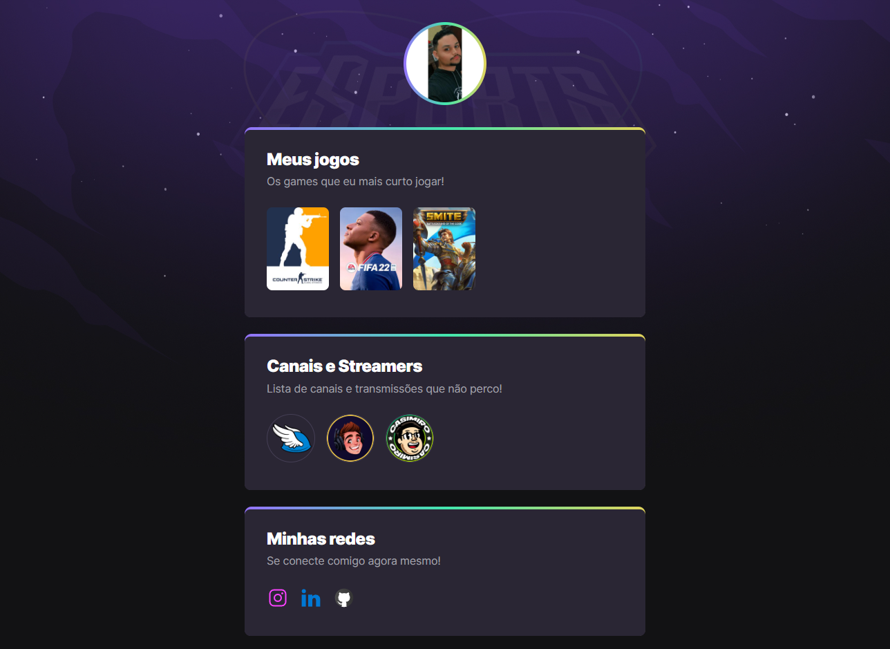

# Projeto desenvolvido no evento Next Level Week da Rocketseat 🚀

## 🛠️ Tecnologias
- HTML
- CSS

## 🧠 Aprendizado

- Através desse projeto consegui aprender e colocar em prática novas funções do css.

- Muitas dicas sobre soft skills támbem foram apresentadas nesse evento

## 👨‍💻 Visualização do projeto

- Link para visualização do projeto: https://nlwesportsg.netlify.app

